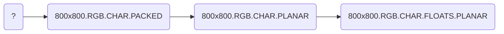

# CUDA TensorRT Integration Tutorial

## Introduction
This implementation demonstrates `TensorRT` integration for `ONNX` model inference using CUDA-accelerated buffer processing. The system utilizes a multi-stage pipeline for input transformation, model inference, and output processing.

The goal of this example is to show that only a minimum amount of `Nvidia CUDA` knowledge is required to get an `ONNX` model running
using `TensorRT` within the Horison framework.


## Core Components

### Creating the TensorRT network
The `Network.hpp` contains the definition of the required TensorRT 
components for the `ONNX` model in this example.
The function:
```
bool loadOnnxModel(...)
{
    hrs::TRTUniquePtr<nvinfer1::IBuilder> builder(nvinfer1::createInferBuilder(hrs::logger));
    
    if (!builder)
        return false;

   ...
}
```
Will load and create the TensorRT newtork.

### Cuda Buffer management
`Horus_cuda.hpp` provides the following class:

```
HC_buffer(Horus_cuda_code_block_data_buffer *buffer);
HC_buffer(
        const std::string &name,
        size_t chantype,
        size_t numchan,
        size_t width,
        size_t height,
        const std::string &pixfmt,
        const std::string &codec);

bool download(cudaStream_t stream, bool sync = false);
bool upload(cudaStream_t stream, bool sync = false);
bool initialized();
void save(const std::string &path, bool autofilename = true);
```
By using the `HC_buffer` class no knowledge of `cuda` memory managment is required.

### Processing Pipeline
The code defines three main processing stages:
```cpp
void run(User_context *ctx)
{
    // stage 1: convert the input to the network
    convert_input(ctx);

    // stage 2: schedule the network
    bool status = ctx->network.context->enqueueV2(ctx->buffers,   ctx->input->cuda_stream, nullptr);

    // stage 3: convert and draw overlay
    convert_output(ctx);
}
```

## Stages
All the required Kernel operations are handled seperately in this example such that is clear as which operation is being performed. Also having them seperately allows easy modifcations making it easier to adapt the code to your specific needs.  
### 1 Convert input
 `ResNet101_DUC_HDC.onnx` model requires a certain input, being: 800x800 RGB planar float. The corresponding pipeline(`cuda_tensor_rt_segmentation.hrp`) for this example will provide data with unknown resolution, RGB, CHAR and packed. This requires the following transformations:


This is done through scheduling the following functions:
```
launch_scale_image 
launch_packed_to_planar
launch_conversion
```
### 2 Inference
In this stage the TensorRT is being scheduled on a `cudaStream_t` provide by the framework.
```
enqueueV2(ctx->buffers,   ctx->input->cuda_stream, nullptr);
```

### 3 Convert output
The final tensor is a 400x400x19.FLOAT which is in an unordered state. Therefor we require the following transformations to make sense of the output.

```
launch_conversion
launch_rearange
```
After these operations we have image where is pixels are coloured based on its predicted label.
In the last step in this stage we draw the labels over the input image, where the `alpha` value in the pixels contributes to strength of the overlay effect.
```
launch_overlay_image
```

### 4 Dense Upsampling Convolution
A link to the required [model](https://github.com/kiritigowda/models-1/blob/master/models/semantic_segmentation/DUC/README.md/).